# STM32F7 project initialisation

This page describes step by step how was created the project with FreeRTOS and FreeRTOS Plus for STM32F7.

## VSCode extension

Install the VSCode extension "STM32 For VSCode

## Project init

We need to init the working directory. 

1. Create a directory `stm32freertos_plus_template` and go into it

```bash
mkdir stm32freertos_plus_template/ && cd stm32freertos_plus_template/
```

2. Init environnement variable

```bash
WORKDIR="$PWD"
```

## Git

Init git repository:

```bash
git init
```

## CubeMX

1. Create new project

```
File>New Project
```

2. Select the corresponding MCU, here STM32F779NIH6

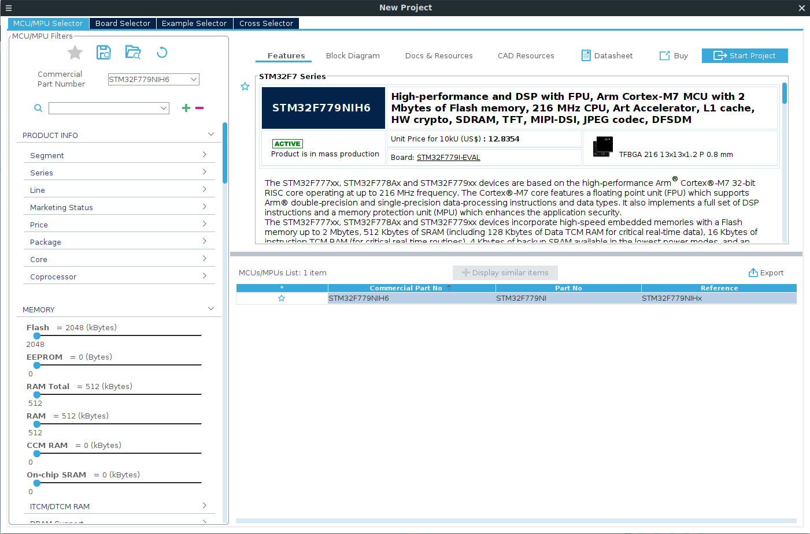

3. Activate memory protection unit (not sure about this part)

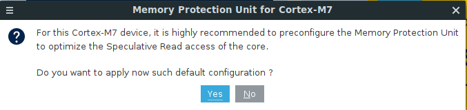

4. Activate the modules you need. You have to select at least FreeRTOS

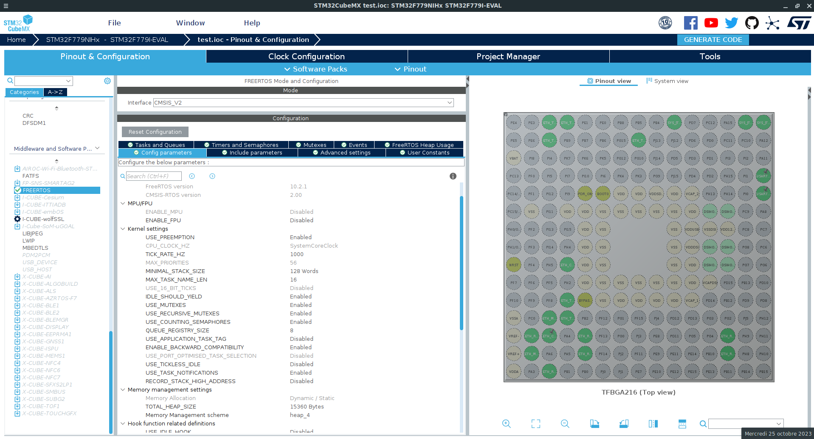

5. The FreeRTOS configuration

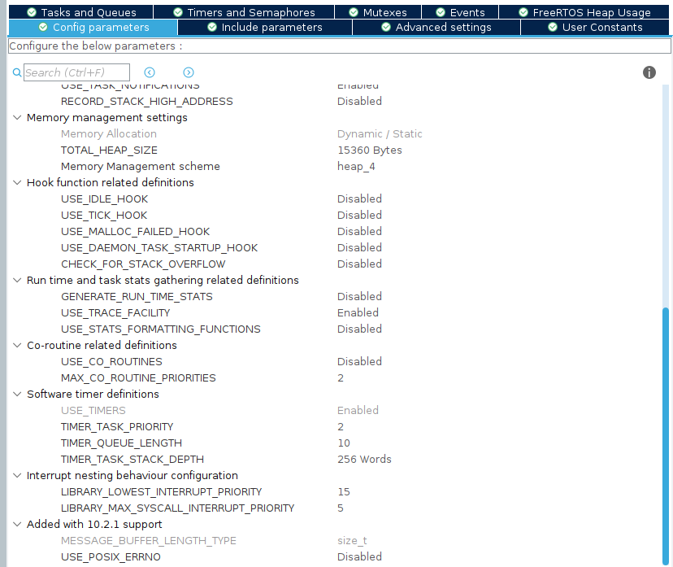
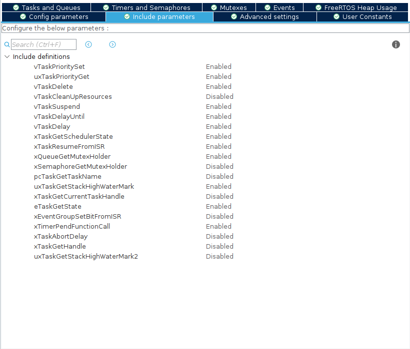
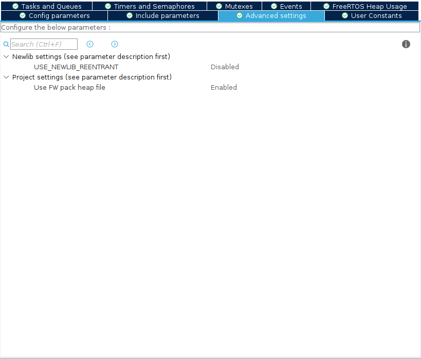
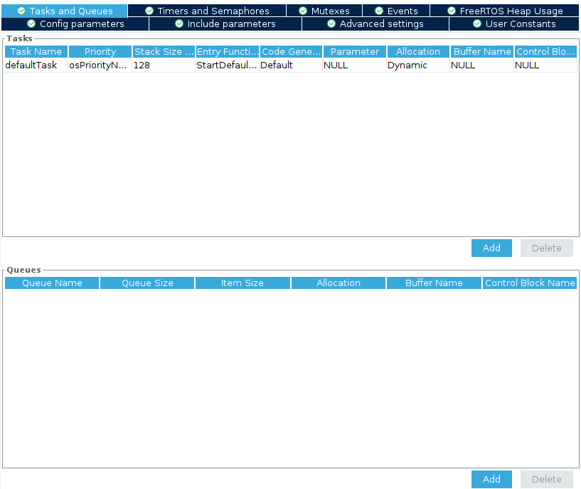
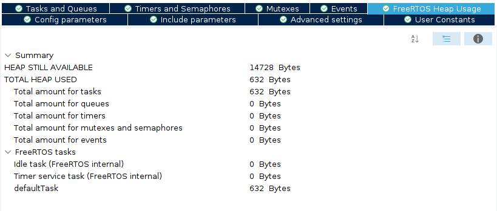

6. Ethernet configuration

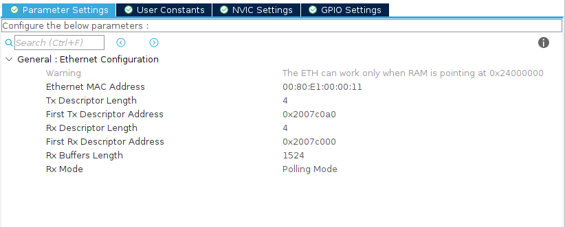
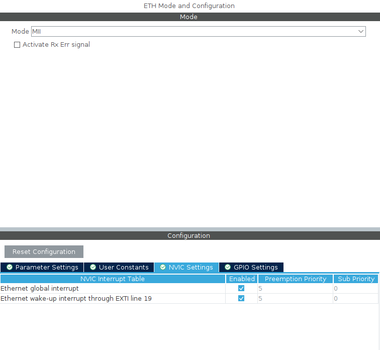
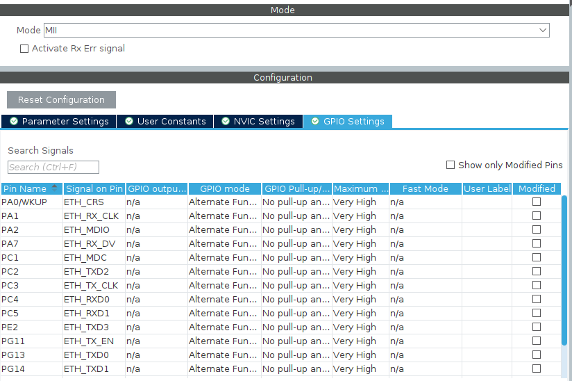
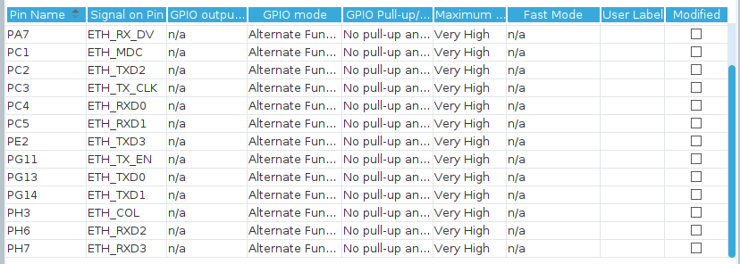

7. Clock configuration: you may need to click on "Resolve Clock Issues"

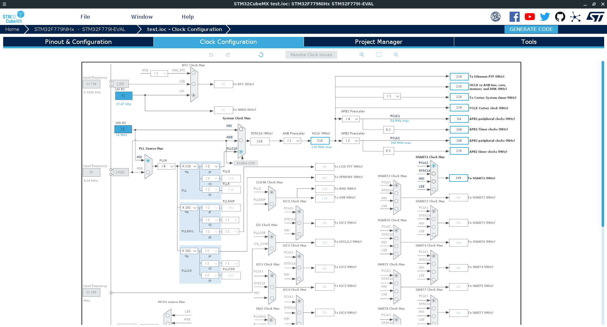

8. Project manager: don't forget to select Makefile as Toolchain / IDE

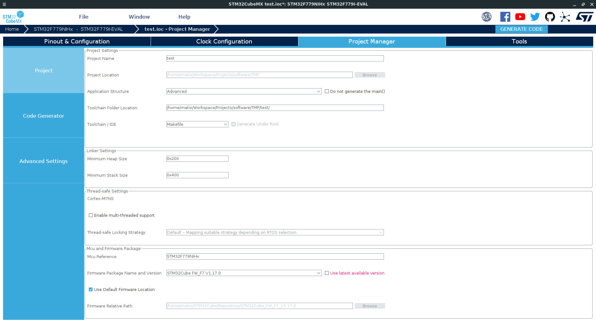

9. Save the project in the directory where you initiated the git repository

10. Click on "Generate Code"

11. Important: Build once with the "STM32 For VSCode" extension to generate the required files

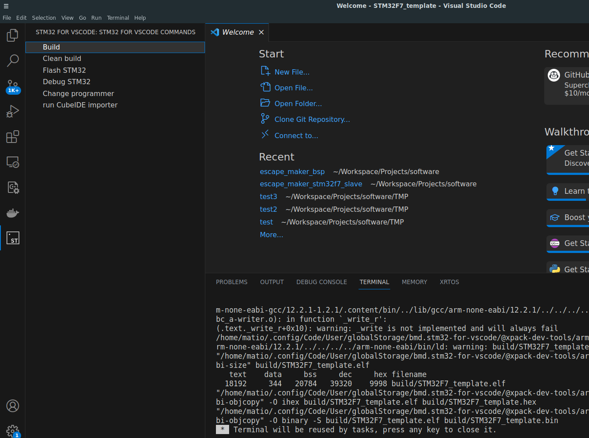

## CMSIS RTOS V2

You need to copy the `CMSIS_RTOS_V2/` directory from the `Middlewares/` directory generated.

```bash
cp -r $WORKDIR/Middlewares/Third_Party/FreeRTOS/Source/CMSIS_RTOS_V2 $WORKDIR/Drivers/
```

## STM32F7xx HAL

For now, the HAL v1.3.0 is too new for the FreeRTOS-Plus library. So we need to change the version of the HAL to v1.2.10.

1. You have to remove the directory of the HAL here: `Drivers/STM32F7xx_HAL_Driver/` and `Middlewares/`

```bash
rm -rf $WORKDIR/Middlewares/
rm -rf $WORKDIR/Drivers/STM32F7xx_HAL_Driver/
```

2. Add STM32F7 HAL as submodule in the directory `Drivers/`

```bash
cd $WORKDIR/Drivers/
git submodule add git@github.com:STMicroelectronics/stm32f7xx_hal_driver.git
```

3. Change directory in `Drivers/stm32f7xx_hal_driver/`. Checkout on tag v1.2.0

```bash
cd $WORKDIR/Drivers/stm32f7xx_hal_driver/
git checkout v1.2.10
```

## FreeRTOS-Plus

Now we have to add FreeRTOS-Plus module.

1. At root of the project, add FreeRTOS as submodule

```bash
cd $WORKDIR
git submodule add git@github.com:FreeRTOS/FreeRTOS.git
```

2. Change directory to `FreeRTOS/`, then load submodules of freeRTOS

```bash
cd $WORKDIR/FreeRTOS/
git submodule update --init --recursive
```

3. Copy `FreeRTOSIPConfig.h` example in Core/Inc/ directory

```bash
cp $WORKDIR/FreeRTOS/FreeRTOS-Plus/Demo/FreeRTOS_Plus_TCP_Echo_Posix/FreeRTOSIPConfig.h $WORKDIR/Core/Inc/
```

4. Copy `core_mqtt_config.h` example in Core/Inc/ directory

```bash
cp $WORKDIR/FreeRTOS/FreeRTOS-Plus/Demo/coreMQTT_Windows_Simulator/Common/core_mqtt_config.h $WORKDIR/Core/Inc/
```

5. Add following define for the STM32F7xx ifdef in `Core/Inc/FreeRTOSIPConfig.h`

```c
#define STM32F7xx		                    1
```

## CMSIS Device

To build for STM32F7, you need CMSIS for corresponding MCU. To di it, go in the `Drivers/` directory and add the `cmsis_device_f7` submodule

```bash
cd $WORKDIR/Drivers/
git submodule add git@github.com:STMicroelectronics/cmsis_device_f7.git
```


## CMSIS Core

You also need soe CMSIS core files. Again in the `Drivers/` directory, add the `cmsis_core` submodule

```bash
cd $WORKDIR/Drivers/
git submodule add git@github.com:STMicroelectronics/cmsis_core.git
```

## Makefile

We modified many files of the project, so we need to update the file list in `C_INCLUDES` and `C_SOURCES`. Delete all files in lists. Replace them in the list bellow.

1. New `C_INCLUDES` list

```makefile
# C includes
C_INCLUDES = \
-ICore/Inc \
-IDrivers/CMSIS/Device/ST/STM32F7xx/Include \
-IDrivers/CMSIS/Include \
-IDrivers/CMSIS_RTOS_V2 \
-IDrivers/stm32f7xx_hal_driver/Inc \
-IDrivers/stm32f7xx_hal_driver/Inc/Legacy \
-IDrivers/CMSIS/Core/Include

# freertos
C_INCLUDES += \
-IFreeRTOS/FreeRTOS/Source/include \
-IFreeRTOS/FreeRTOS/Source/portable/GCC/ARM_CM7/r0p1 \
-IFreeRTOS/FreeRTOS-Plus/Source/Utilities/logging

# freertos plus
C_INCLUDES += \
-IFreeRTOS/FreeRTOS-Plus/Source/FreeRTOS-Plus-TCP/source/include \
-IFreeRTOS/FreeRTOS-Plus/Source/FreeRTOS-Plus-TCP/source/portable/Compiler/GCC \
-IFreeRTOS/FreeRTOS-Plus/Source/FreeRTOS-Plus-TCP/source/portable/NetworkInterface/STM32Fxx \
-IFreeRTOS/FreeRTOS-Plus/Source/FreeRTOS-Plus-TCP/source/portable/NetworkInterface/include \
-IFreeRTOS/FreeRTOS/Demo/CORTEX_M7_STM32F7_STM32756G-EVAL_IAR_Keil/ST_Library/include
```

2. New `C_SOURCES` list:

``` makefile
# C sources, core
C_SOURCES = Core/Src/main.c \
Core/Src/stm32f7xx_it.c \
Core/Src/stm32f7xx_hal_msp.c \
Core/Src/stm32f7xx_hal_timebase_tim.c \
Core/Src/system_stm32f7xx.c

# Drivers
C_SOURCES += \
Drivers/stm32f7xx_hal_driver/Src/stm32f7xx_hal_cortex.c \
Drivers/stm32f7xx_hal_driver/Src/stm32f7xx_hal_rcc.c \
Drivers/stm32f7xx_hal_driver/Src/stm32f7xx_hal_rcc_ex.c \
Drivers/stm32f7xx_hal_driver/Src/stm32f7xx_hal_flash.c \
Drivers/stm32f7xx_hal_driver/Src/stm32f7xx_hal_flash_ex.c \
Drivers/stm32f7xx_hal_driver/Src/stm32f7xx_hal_gpio.c \
Drivers/stm32f7xx_hal_driver/Src/stm32f7xx_hal_dma.c \
Drivers/stm32f7xx_hal_driver/Src/stm32f7xx_hal_dma_ex.c \
Drivers/stm32f7xx_hal_driver/Src/stm32f7xx_hal_pwr.c \
Drivers/stm32f7xx_hal_driver/Src/stm32f7xx_hal_pwr_ex.c \
Drivers/stm32f7xx_hal_driver/Src/stm32f7xx_hal.c \
Drivers/stm32f7xx_hal_driver/Src/stm32f7xx_hal_i2c.c \
Drivers/stm32f7xx_hal_driver/Src/stm32f7xx_hal_i2c_ex.c \
Drivers/stm32f7xx_hal_driver/Src/stm32f7xx_hal_exti.c \
Drivers/stm32f7xx_hal_driver/Src/stm32f7xx_hal_tim.c \
Drivers/stm32f7xx_hal_driver/Src/stm32f7xx_hal_tim_ex.c \
Drivers/stm32f7xx_hal_driver/Src/stm32f7xx_hal_uart.c \
Drivers/stm32f7xx_hal_driver/Src/stm32f7xx_hal_uart_ex.c \
Drivers/CMSIS_RTOS_V2/cmsis_os2.c

# FreeRTOS
C_SOURCES += \
FreeRTOS/FreeRTOS/Source/croutine.c \
FreeRTOS/FreeRTOS/Source/event_groups.c \
FreeRTOS/FreeRTOS/Source/list.c \
FreeRTOS/FreeRTOS/Source/queue.c \
FreeRTOS/FreeRTOS/Source/stream_buffer.c \
FreeRTOS/FreeRTOS/Source/tasks.c \
FreeRTOS/FreeRTOS/Source/timers.c \
FreeRTOS/FreeRTOS/Source/portable/MemMang/heap_4.c \
FreeRTOS/FreeRTOS/Source/portable/GCC/ARM_CM7/r0p1/port.c

# FreeRTOS-Plus TCP
C_SOURCES += FreeRTOS/FreeRTOS-Plus/Source/FreeRTOS-Plus-TCP/source/FreeRTOS_ARP.c \
FreeRTOS/FreeRTOS-Plus/Source/FreeRTOS-Plus-TCP/source/FreeRTOS_BitConfig.c \
FreeRTOS/FreeRTOS-Plus/Source/FreeRTOS-Plus-TCP/source/FreeRTOS_DHCP.c \
FreeRTOS/FreeRTOS-Plus/Source/FreeRTOS-Plus-TCP/source/FreeRTOS_DHCPv6.c \
FreeRTOS/FreeRTOS-Plus/Source/FreeRTOS-Plus-TCP/source/FreeRTOS_DNS.c \
FreeRTOS/FreeRTOS-Plus/Source/FreeRTOS-Plus-TCP/source/FreeRTOS_DNS_Cache.c \
FreeRTOS/FreeRTOS-Plus/Source/FreeRTOS-Plus-TCP/source/FreeRTOS_DNS_Callback.c \
FreeRTOS/FreeRTOS-Plus/Source/FreeRTOS-Plus-TCP/source/FreeRTOS_DNS_Networking.c \
FreeRTOS/FreeRTOS-Plus/Source/FreeRTOS-Plus-TCP/source/FreeRTOS_DNS_Parser.c \
FreeRTOS/FreeRTOS-Plus/Source/FreeRTOS-Plus-TCP/source/FreeRTOS_ICMP.c \
FreeRTOS/FreeRTOS-Plus/Source/FreeRTOS-Plus-TCP/source/FreeRTOS_IP.c \
FreeRTOS/FreeRTOS-Plus/Source/FreeRTOS-Plus-TCP/source/FreeRTOS_IP_Timers.c \
FreeRTOS/FreeRTOS-Plus/Source/FreeRTOS-Plus-TCP/source/FreeRTOS_IP_Utils.c \
FreeRTOS/FreeRTOS-Plus/Source/FreeRTOS-Plus-TCP/source/FreeRTOS_IPv4.c \
FreeRTOS/FreeRTOS-Plus/Source/FreeRTOS-Plus-TCP/source/FreeRTOS_IPv4_Sockets.c \
FreeRTOS/FreeRTOS-Plus/Source/FreeRTOS-Plus-TCP/source/FreeRTOS_IPv4_Utils.c \
FreeRTOS/FreeRTOS-Plus/Source/FreeRTOS-Plus-TCP/source/FreeRTOS_IPv6.c \
FreeRTOS/FreeRTOS-Plus/Source/FreeRTOS-Plus-TCP/source/FreeRTOS_IPv6_Sockets.c \
FreeRTOS/FreeRTOS-Plus/Source/FreeRTOS-Plus-TCP/source/FreeRTOS_IPv6_Utils.c \
FreeRTOS/FreeRTOS-Plus/Source/FreeRTOS-Plus-TCP/source/FreeRTOS_ND.c \
FreeRTOS/FreeRTOS-Plus/Source/FreeRTOS-Plus-TCP/source/FreeRTOS_RA.c \
FreeRTOS/FreeRTOS-Plus/Source/FreeRTOS-Plus-TCP/source/FreeRTOS_Routing.c \
FreeRTOS/FreeRTOS-Plus/Source/FreeRTOS-Plus-TCP/source/FreeRTOS_Sockets.c \
FreeRTOS/FreeRTOS-Plus/Source/FreeRTOS-Plus-TCP/source/FreeRTOS_Stream_Buffer.c \
FreeRTOS/FreeRTOS-Plus/Source/FreeRTOS-Plus-TCP/source/FreeRTOS_TCP_IP.c \
FreeRTOS/FreeRTOS-Plus/Source/FreeRTOS-Plus-TCP/source/FreeRTOS_TCP_IP_IPv4.c \
FreeRTOS/FreeRTOS-Plus/Source/FreeRTOS-Plus-TCP/source/FreeRTOS_TCP_IP_IPv6.c \
FreeRTOS/FreeRTOS-Plus/Source/FreeRTOS-Plus-TCP/source/FreeRTOS_TCP_Reception.c \
FreeRTOS/FreeRTOS-Plus/Source/FreeRTOS-Plus-TCP/source/FreeRTOS_TCP_State_Handling.c \
FreeRTOS/FreeRTOS-Plus/Source/FreeRTOS-Plus-TCP/source/FreeRTOS_TCP_State_Handling_IPv4.c \
FreeRTOS/FreeRTOS-Plus/Source/FreeRTOS-Plus-TCP/source/FreeRTOS_TCP_State_Handling_IPv6.c \
FreeRTOS/FreeRTOS-Plus/Source/FreeRTOS-Plus-TCP/source/FreeRTOS_TCP_Transmission.c \
FreeRTOS/FreeRTOS-Plus/Source/FreeRTOS-Plus-TCP/source/FreeRTOS_TCP_Transmission_IPv4.c \
FreeRTOS/FreeRTOS-Plus/Source/FreeRTOS-Plus-TCP/source/FreeRTOS_TCP_Transmission_IPv6.c \
FreeRTOS/FreeRTOS-Plus/Source/FreeRTOS-Plus-TCP/source/FreeRTOS_TCP_Utils.c \
FreeRTOS/FreeRTOS-Plus/Source/FreeRTOS-Plus-TCP/source/FreeRTOS_TCP_Utils_IPv4.c \
FreeRTOS/FreeRTOS-Plus/Source/FreeRTOS-Plus-TCP/source/FreeRTOS_TCP_Utils_IPv6.c \
FreeRTOS/FreeRTOS-Plus/Source/FreeRTOS-Plus-TCP/source/FreeRTOS_TCP_WIN.c \
FreeRTOS/FreeRTOS-Plus/Source/FreeRTOS-Plus-TCP/source/FreeRTOS_Tiny_TCP.c \
FreeRTOS/FreeRTOS-Plus/Source/FreeRTOS-Plus-TCP/source/FreeRTOS_UDP_IP.c \
FreeRTOS/FreeRTOS-Plus/Source/FreeRTOS-Plus-TCP/source/FreeRTOS_UDP_IPv4.c \
FreeRTOS/FreeRTOS-Plus/Source/FreeRTOS-Plus-TCP/source/FreeRTOS_UDP_IPv6.c \
FreeRTOS/FreeRTOS-Plus/Source/FreeRTOS-Plus-TCP/source/portable/NetworkInterface/Common/phyHandling.c \
FreeRTOS/FreeRTOS-Plus/Source/FreeRTOS-Plus-TCP/source/portable/BufferManagement/BufferAllocation_2.c \
FreeRTOS/FreeRTOS-Plus/Source/FreeRTOS-Plus-TCP/source/portable/NetworkInterface/STM32Fxx/NetworkInterface.c \
FreeRTOS/FreeRTOS-Plus/Source/FreeRTOS-Plus-TCP/source/portable/NetworkInterface/STM32Fxx/stm32fxx_hal_eth.c
```

As you can see, I use the FreeRTOS ethernet driver for STM32. It's important to use the file provided by FreeRTOS and not the one provided by STM.

3. Update libs and flag to use rdimon instead of nano

```makefile
LIBS = -lc -lm -lrdimon 
LIBDIR = 
LDFLAGS = $(MCU) -specs=rdimon.specs -T$(LDSCRIPT) $(LIBDIR) $(LIBS) -Wl,-Map=$(BUILD_DIR)/$(TARGET).map,--cref -Wl,--gc-sections
```

## Use the main example

Replace the generated `Core/Src/main.c` and `Core/Src/main.h` by the one provided in this repository.

